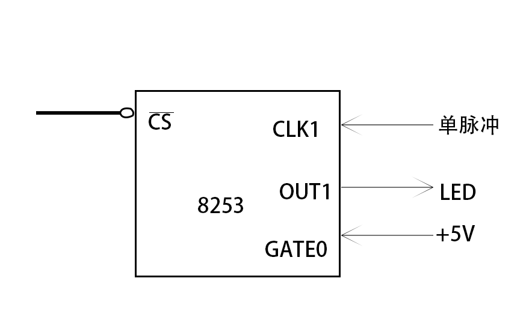

# 作业 8253应用实验1

## 第一题

由题意得：控制字=00010001B=11H

### 连接图


### 流程图

```flow
st=>start: 开始
ed=>end: 结束
op1=>operation: AL<-控制字
op2=>operation: AL->控制口
op3=>operation: 计数初值->AL
op4=>operation: 通道0<-AL

st->op1->op2->op3->op4->ed
```

### 程序

```X86ASM
DATA SEGMENT
DATA ENDS
CODE SEGMENT
ASSUME CS:CODE,DS:DATA
START:
	MOV AX,DATA
	MOV DS,AX
	MOV AL,11H
	MOV DX,283H
	OUT DX,AL
	MOV AL,10
	MOV DX,280H
	OUT DX,AL
	MOV AH,4CH
	INT 21H
CODE ENDS
END START
```

## 第二题

由题意得：控制字=01010100B=54H

### 连接图



### 流程图


```flow
st=>start: 开始
ed=>end: 结束
op1=>operation: AL<-控制字
op2=>operation: AL->控制口
op3=>operation: 计数初值->AL
op4=>operation: 通道1<-AL

st->op1->op2->op3->op4->ed
```

### 程序

```x86asm
MOV AL,54H
MOV DX,283H
OUT DX,AL
MOV AL,10
MOV DX,281H
OUT DX,AL
```

